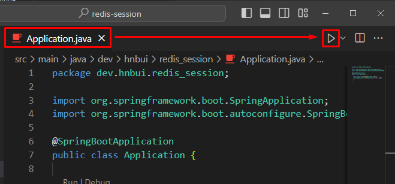
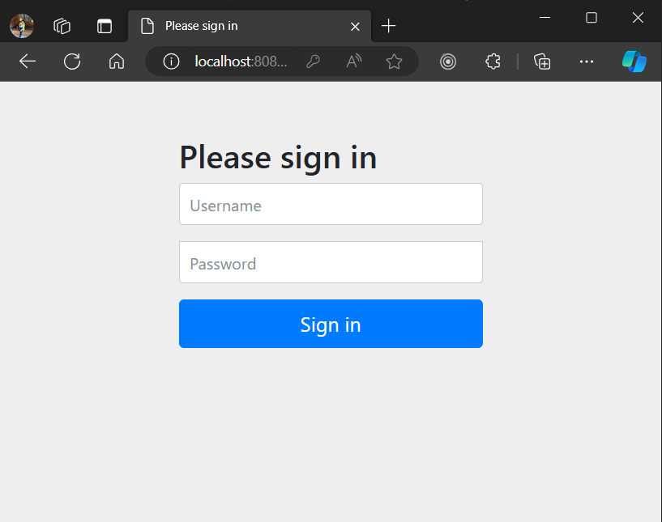
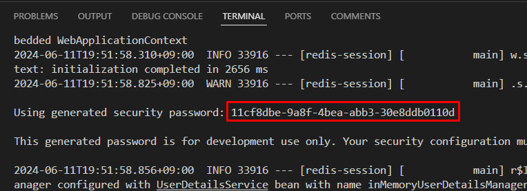
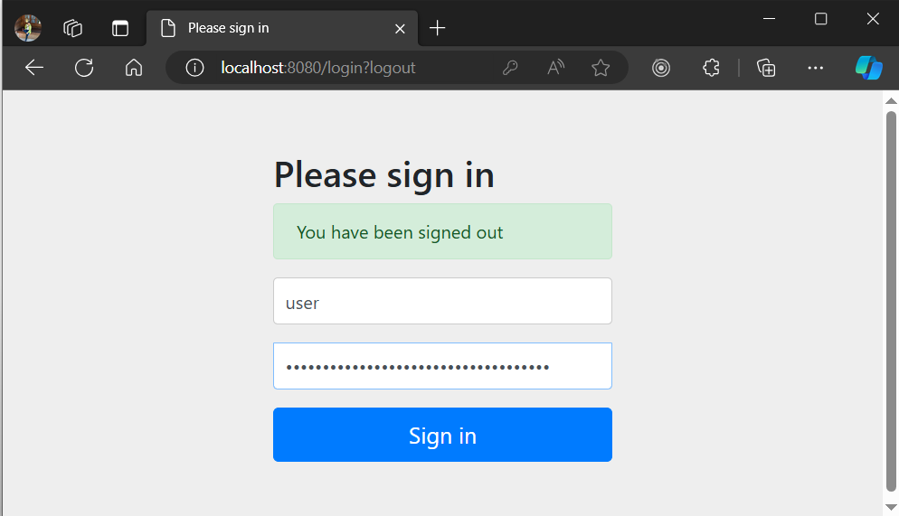
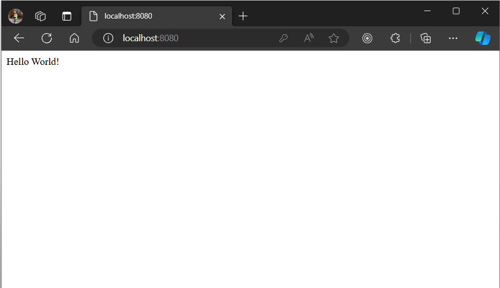
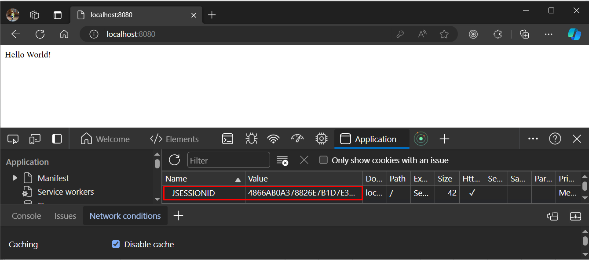
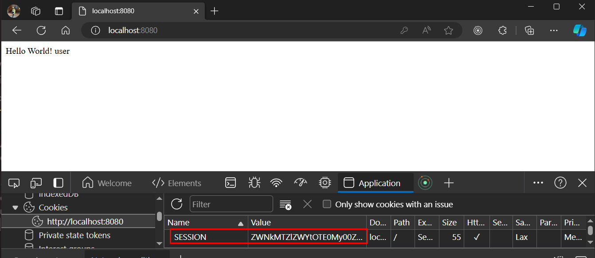
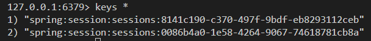

# Demystifying Spring Session
## Introduction
* Youtube: https://www.youtube.com/watch?v=k62bO-W6Sb0
* The program can run on VS Code by clicking play button when Application.java is being open 
* Update Maven project `mvn clean install -U` 
* redis-cli: `docker exec -it redis-session-redis-1 redis-cli`
## Step by step
### Step 1: Temporarily disable Redis
You will see Spring Security default login page (http://localhost:8080/login)

### Step 2: How to used generated security password
* Get the generated security password from log: 
* Login with `user/<generated_password>` 
* See the home page 

Further discussion:
* After logged in, we get a JSESSIONID in Cookies 
* This session is not deleted when you access /logout + confirm, it changes to another value instead
* This session will change if you access /login and log in again

Problem:
* If you restart the server, the new server does not know your session id
* If you scale up the system, add more server and connect to them through load balancer, the randomly new server does not know your session id
* This is where Spring Session comes in
### Step 3: Add Redis && Add docker-compose.yml to support redis
* When Redis-based session is applied, the session name in cookies is SESSION, not JSESSIONID 
### Step 4: Test Redis & Test session's key-value feature
* In application.properties, set `spring.docker.compose.lifecycle-management=start_only` to start redis container on start only (do not stop redis container on close)
* Use `keys *` to get all the keys 
* You can set & get attributes using key-value